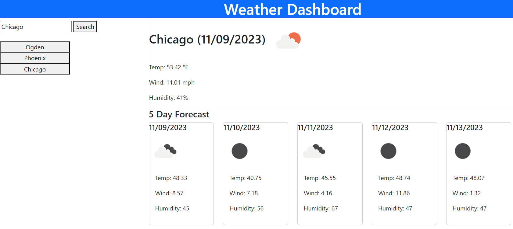

# weather-dashboard

 

## Links

<ul>
<li> <a href = "https://github.com/CatCorbin/weather-dashboard">GitHub Repository</a> </li>
<li> <a href = "https://catcorbin.github.io/weather-dashboard/">Deployed Link</a> </li>
</ul>

## Description

This application is a weather dashboard made with HTML, CSS, and JavaScript. I also utilized Bootstrap and the Open Weather API for weather data. It is designed to be used similarly to other weather sites. Upon load, the main page is set to display the current weather in Ogden, Utah-my hometown. The user can search other cities and see current weather and 5 day forecasts. A search history will also be populated on the users' browser.

## Table of Contents

- [Installation](#installation)
- [Usage](#usage)
- [License](#license)
- [Contributions](#contributions)
- [Tests](#tests)
- [Questions](#questions)

## Installation

No installation required.

## Usage

When the site is first loaded, Ogden UT will be automatically displayed. There is a search bar for the user to search any city they wish, and when the search button is hit, the current weather as well as the 5 day forecast will be loaded for that city. Furthermore, any city the user searches will be added to their search history which is displayed underneather the city search bar.

## License

MIT

## Contributions

None

## Tests

Test using deployed link

## Questions
<ul>
<li> <a href = "https://github.com/CatCorbin">GitHub Profile</a>
</li>
<li> <a href = "mailto:catcorbin0919@gmail.com">Email </a> </li>
</li>